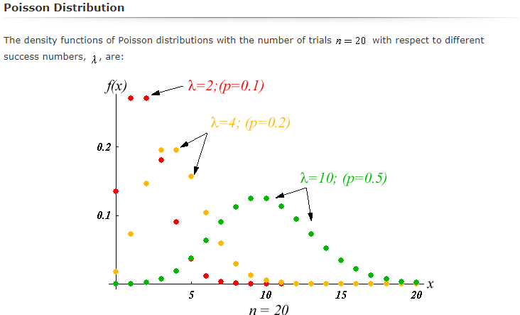

Install the libraries to be used

```{r setup}
knitr::opts_chunk$set(fig.width=10, fig.height=6) 
if (!require(MASS)){install.packages("MASS")}
if (!require(corrplot)){install.packages("corrplot")}
if (!require(forecast)){install.packages("forecast")}
if (!require(psych)){install.packages("psych")}
if(!require(dplyr)){install.packages("dplyr")}
if(!require(tidyverse)){install.packages("tidyverse")}
if(!require(corrplot)){install.packages("corrplot")} 
if(!require(AER)){install.packages("AER")} 
if(!require(splines)){install.packages("splines")} 
if(!require(survival)){install.packages("survival")} 
if(!require(survminer)){install.packages("survminer")} 
if(!require(pastecs)){install.packages("pastecs")}
if(!require(mice)){install.packages("mice")} 
if(!require(VIM)){install.packages("VIM")} 
if(!require(lattice)){install.packages("lattice")}

library(MASS)
library(corrplot)
library(forecast)
library(psych)
library(dplyr)
library(tidyverse)
library(AER)
library(splines)
library(survival)
library(survminer)
library(pastecs) 
library(mice)
library(VIM)
library(lattice)
```
### <span style="color:red">A. Beluga Whale Calves at the Aquarium for Wildlife Conservation:</span>

Read the csv file with lock on data to R data and seggregate datasets for Hudson and Casey:

```{r read file}
whales.df <- read.csv(file.choose(), stringsAsFactors =FALSE)

colnames <- c("Period","Bouts","Lockons","Daytime")
lockonsHudson.df <- cbind(whales.df$Period.Hudson,whales.df$Bouts.Hudson,whales.df$Lockons.Hudson,whales.df$Daytime.Hudson)
colnames(lockonsHudson.df) <- colnames
lockonsCasey.df <- cbind(whales.df$Period.Casey,whales.df$Bouts.Casey,whales.df$Lockons.Casey,whales.df$Daytime.Casey)
colnames(lockonsCasey.df) <- colnames
lockonsHudson.df <- data.frame(lockonsHudson.df)
lockonsCasey.df <- data.frame(lockonsCasey.df)
lockonsHudson.df$Daytime <-as.factor(lockonsHudson.df$Daytime)
lockonsCasey.df$Daytime <-as.factor(lockonsCasey.df$Daytime)

```

### <span style="color:blue">A 1. Obtain summary statistics for the two whale calves, Hudson and Casey and make comparative statement. </span>

Based on the summary statistics and plots below, we can clearly see the following -

1. The number of zeros in the lockons data for Hudson and casey are low.
2. The mean and variances for both Hudson and Casey for Lockons are significantly different (variance is about 5 times of mean).
3. There is significant difference in mean lockons for Hudson and Casey. Hudson has significantly lower mean lockons for slightly lower mean bouts and Casey has significantly higher mean lockons for slightly higher mean bouts.
4. The mean and median is roughly same for lockons for both Hudson and Casey suggestive not many outliers as can be seen in box plots (5 outliers for Hudson and 3 for casey for Lockons).
5. The summary statistics suggests few NAs for Casey (5) and none for Hudson, upon closer examination of original data set we find that for Hudson we have 5 rows more than Casey. So i have removed NAs from Casey dataset.
6. The mean values for Bouts and Lockons for day and night for both Hudson are Casey are near about same, suggestive of no clear preference for Day or Night time for Bouts and Lockons i.e. this variable is likely to be insignificant.
7. There is strong positive correlation between Bouts and Lockons for both Hudson and Casey which is expected, however there is a weak negative correlation between Period and Lockons for Casey which suggests a drop in Lockons with increasing periods for Casey which i guess is natural as the calf will eventually move away from mothers milk so this is a good sign for Casey but for Hudson it suggests longer nursing period as correlationis-0.04.

```{r get summary statistics}
print("Summary Statistics for Hudson")
summary(lockonsHudson.df)
stat.desc(lockonsHudson.df, basic=TRUE, desc=TRUE)

print("Summary Statistics for Casey")
summary(lockonsCasey.df)
stat.desc(lockonsCasey.df, basic=TRUE, desc=TRUE)

print("Mode of Lockons for Hudson")
y <- table(lockonsHudson.df$Lockons)
names(y)[which(y==max(y))]

print("Mode of Lockons for Casey")
y <- table(lockonsCasey.df$Lockons)
names(y)[which(y==max(y))]

lockonsHudson.df %>% tally() # row count
lockonsCasey.df %>% tally() # row count

print("Means by Day time")
lockonsHudson.df %>%  group_by(Daytime) %>%  summarise_all(mean, na.rm=TRUE)
lockonsCasey.df %>%  group_by(Daytime) %>%  summarise_all(mean, na.rm=TRUE)
#lockonsHudson.df %>% count(Lockons, sort = TRUE) %>% arrange(Lockons)
#lockonsCasey.df %>% count(Lockons, sort = TRUE) %>% arrange(Lockons)

plot(table(lockonsHudson.df$Lockons), main="Lockon frequency - Hudson",xlab="No of Lockons - Hudson", ylab="Frequency")
plot(table(lockonsCasey.df$Lockons), main="Lockon frequency - Casey",xlab="No of Lockons - Casey", ylab="Frequency")
lockonsCasey.df <- na.omit(lockonsCasey.df)

print("Correlation plot for Hudson")
M <- cor(lockonsHudson.df[,1:3])
corrplot(M, method = "number")

print("Correlation plot for Casey")
M <- cor(lockonsCasey.df[,1:3])
corrplot(M, method = "number")

boxplot(lockonsHudson.df[,1:3], horizontal=TRUE, main="Box plot of all variables - Hudson")
boxplot(lockonsCasey.df[,1:3], horizontal=TRUE, main="Box plot of all variables - Casey")

```

### <span style="color:blue">A 2. Make comparative statements on the underlying probability distributions of the number of lockons of the two calves. With justification, propose appropriate regression model for number of lockons for each data set.</span>

The underlying distributions for lockons for Hudson is right skewed similar to Poison PMF with labda near 5 and Casey is slightly right skewed but closer to normal (has higher mean at 27) similar to Poison PMF with lambda between 10 - 20, this is also evident from mode, median and mean value of 22,25 and 27 respectively for Casey. The distributions suggest trying out a Poison regression model. We can compare the distributions to the Poison PMF plots for different lambdas as shown below (Plot taken from - http://www.efunda.com/math/distributions/PoissonDistPlot.cfm) -

```{r Plot lockon distribution}
par(mfrow=c(1, 1))
colnames <- c("LockOns Hudson", "LockOns Casey")
locombined.df <- cbind(lockonsHudson.df$Lockons, lockonsCasey.df$Lockons)
colnames(locombined.df) <- colnames
locombined.df <- data.frame(locombined.df)

for (i in 1:2) {
    hist(locombined.df[,i], xlim=c(0, 100), breaks=seq(0, 100, 5), main=colnames[i], probability=TRUE, col="gray", border="white")
    d <- density(locombined.df[,i])
    lines(d, col="red")
}

```

```{r pressure, echo=FALSE, fig.cap="A caption", out.width = '100%'}

```
### <span style="color:blue">A 3. For each data set, construct the regression model you have proposed in (2) above for the number of lockons in each period as a function of time, number of nursing bouts, and time of the day. Interpret your results.</span>

I first fitted the Poisson model. The Poisson model a high residual deviance compared to degrees of freedom for both Hudson and Casey (nealy double and negligible p value for both) and the overdispersion test is suggestive of overdispersion for both Hudson and casey which are indicative of a poor fit for Poisson model. 
Below is an analysis of the diagnostic plots -

Hudson dataset-
The Residuals vs the fitted plot is not random but more concentrated in center indicative of poor fit.
The Normal QQ plot shows a skewed distribution.
The Scale location plot shows unequal dispersion suggestive of over dispersion.
Residuals vs Leverage plot shows some influential values like row nos-86, 196,213. 

Casey Dataset-
The Residuals vs the fitted plot is not random but more concentrated in center indicative of a poor fit.
The Normal QQ plot shows a better fit than Hudson dataset but still a skewed distribution.
The Scale location plot shows unequal dispersion suggestive of over dispersion.
Residuals vs Leverage plot shows some influential values like row nos-137, 143, 219

```{r Poisson Model Fitting }
# Fitting Poison
fm_poisHudson <- glm(Lockons ~ Bouts + Daytime, data = lockonsHudson.df, family = poisson)#,offset = log(Period))
summary(fm_poisHudson)
dispersiontest(fm_poisHudson,trafo = 1)

anova(fm_poisHudson)
par(mfrow=c(1,1))
plot(fm_poisHudson)
par(mfrow=c(1,1))
with(fm_poisHudson,cbind(res.deviance=deviance, df=df.residual,p=pchisq(deviance, df.residual, lower.tail=FALSE)))

fm_poisCasey <- glm(Lockons ~ Bouts + Daytime, data = lockonsCasey.df, family = poisson,offset = log(Period))
summary(fm_poisCasey)
dispersiontest(fm_poisCasey,trafo = 1)

anova(fm_poisCasey)
par(mfrow=c(1,1))
plot(fm_poisCasey)
par(mfrow=c(1,1))
with(fm_poisCasey,cbind(res.deviance=deviance, df=df.residual,p=pchisq(deviance, df.residual, lower.tail=FALSE)))
```

### <span style="color:blue">A 4.1. Do the variables provide predictive power? Justify.</span>

Model fit statistic R -square - 

For Hudson = 1- (Residual Deviance of full model)/(Residual deviance of the null model) = 1 - (571.65)/1213 = 0.528, shows that the model accounts for half the deviance in number of lockons for Hudson.

For Casey = 1- (Residual Deviance of full model)/(Residual deviance of the null model) = 1 - (461.15)/1061.86 = 0.565, shows that the model accounts for slightly more than half the deviance in number of lockons for Casey.

Looking at regression output after fitting the Poisson model for Hudson and Casey, we can see that the Coefficients for Bouts and Periods variable are statistically significant for both whale calf's. Daytime variable is not significant for both calf's as was evident from point 6 under Question 1. 

So the variables Bouts and Periods do have predictive power as was seen from correlation matrix plot as well.

### <span style="color:blue">A 4.2. How would you interpret the coefficient for time period for the model?</span>

As only Periods and Bouts are statistically significant, As Poisson regresson model is log-link model, For the Hudson dataset, the coefficient of time (Period) can be interpereted as the expected log(number of lockons) for one time period (6 Hrs) increase in period is -0.0008701 and so the ratio of number of lockons at time period x + 1 (6 Hrs) to time period x is exp(-0.0008701) ~ 0.99913 when Bouts is kept constant - meaning a decrease of 0.09% in lockons in each subsequent time period if Bouts is held constant for each unit increase in Period.

For the Casey dataset, the coefficient of time (Period) can be interpereted as the expected log(number of lockons) for one time period (6 Hrs) increase in period is -0.0011639 and so the ratio of number of lockons at time period x + 1 (6 Hrs) to time period x is exp(-0.0011639) ~ 0.99884 when Bouts is kept constant - meaning a decrease of 0.12% in lockons in each subsequent time period if Bouts is held constant for each unit increase in Period.

### <span style="color:blue">A 4.3. Does this model suffer from over dispersion? Justify with appropriate analysis. If the selected model suffers from over dispersion, propose and fit an alternative model which will take care of over dispersion.</span>

The Poisson model i have fitted does suffer from overdispersion for both Hudson and Casey datasets. This justified by the overdispersion test result of negligible p-values as shown below - 

For Hudson - 
data:  fm_poisHudson
z = 5.571, p-value = 1.266e-08

For Casey - 
data:  fm_poisCasey
z = 4.4633, p-value = 4.035e-06

Also the Scale location plot for both the datasets shows unequal dispersion suggestive of over dispersion.

As the number of 0 count for lockons is low for both the datasets, it can be assumed that the overdispersion is not due to excess zeros and more due to heterogeneity of population, to accomodate overdispersion i propose the Negative Binomial model.

Next I fitted a negative binomial model to account for overdispersion by treating the parameter µ itself as a random
variable. i.e. instead of modeling Yi as Poisson(µi) we model Yi|µi ??? Poisson(µi) where µi are random varibles distributed as Gamma with parameters ??i, ????i. This approach leads to Yi following Negative Binomial distribution.

```{r Negative Binomial Regression Model Fitting}
fm_nbinHudson <- MASS::glm.nb(Lockons ~ Period + Bouts + Daytime, data = lockonsHudson.df)
summary(fm_nbinHudson)
anova(fm_nbinHudson)
par(mfrow=c(1,1))
plot(fm_nbinHudson)
par(mfrow=c(1,1))
with(fm_nbinHudson,cbind(res.deviance=deviance, df=df.residual,p=pchisq(deviance, df.residual, lower.tail=FALSE)))

fm_nbinCasey <- MASS::glm.nb(Lockons ~ Period + Bouts + Daytime, data = lockonsCasey.df)
summary(fm_nbinCasey)
anova(fm_nbinCasey)
par(mfrow=c(1,1))
plot(fm_nbinCasey)
par(mfrow=c(1,1))
with(fm_nbinCasey,cbind(res.deviance=deviance, df=df.residual,p=pchisq(deviance, df.residual, lower.tail=FALSE)))


```
### <span style="color:blue">A 4.4. Does this alternative model have different implications than the initial model you selected in (3) above? Is it a better fit to the data? Justify your answer with proper analysis.</span>

The Negative Binomial model provides different implications. Negative binomial regression could be used when the conditional variance exceeds the conditional mean. It can be considered as a generalization of Poisson regression since it has the same mean structure and it has an extra parameter to model the over-dispersion. If the conditional distribution of the outcome variable is over-dispersed, the confidence intervals for the Negative binomial regression are likely to be narrower as compared to those from a Poisson regression model. A Negative Binomial distribution introduces dependence of events which could couter overdispersion in Poisson if count data violates the assumption if independence between events. Here according to Negative Binomial model only the Bouts variable is statistically significant for the Hudson dataset and both Bouts and Period variables are statistically significant for Casey dataset which is perfectly in sync with the correlation matrix's for both the datasets (refer point 7 above), a possible indication of a better fit.

After fitting the Negative Binomial model to both the datasets, the following obeservations appear - 

Hudson dataset-

The negative binimial model gives a much lower residual deviance compared to Poisson which is near to residual degrees of freedom and the p-value for Goodness of fit is also acceptable at 0.07. The AIC value is also lower compared to Poisson model.

Plots analysis-
The Residuals vs the fitted plot is not entirely random but somewhat concentrated in center indicative of average fit.
The Normal QQ plot shows a decent plot with most values in straight line with some values deviating.
The Scale location plot shows less over dispersion.
Residuals vs Leverage plot shows some outliers like row nos-196,213 etc.

Casey Dataset-

The negative binimial model gives a much lower residual deviance compared to Poisson which is near to residual degrees of freedom though the p-value for Goodness of fit is low at 0.02. The AIC value is also lower compared to Poisson model.

Plots analysis-
The Residuals vs the fitted plot is not entirely random but somewhat concentrated in center indicative of average fit.
The Normal QQ plot shows a decent plot with most values in straight line with some values deviating.
The Scale location plot shows less over dispersion.
Residuals vs Leverage plot shows some outliers like row nos-137,219

Overall negative binomial model fits the lockons count data better accounting for overdispersion to some extent.

### <span style="color:blue">A 5. Using the two models for two calves you have finally selected, make comparative statements on how the predictors are affecting the number of lockons.</span>

Hudson Dataset - 
For this dataset the final model using Negative Binomial suggests that only Bouts variable is statistically significant (this fits well with correlation matrix also). The coefficient of 0.1350092 for Bouts suggests that on an average for a unit increase in Bouts the lockons increase by 14.5% (exp(0.1350092) ~ 1.145). The model clearly picks Bouts are having maximum affect on Lockons for Hudson.

Model fit statistic R -square - 
For Hudson = 1- (Residual Deviance of full model)/(Residual deviance of the null model) = 1 -(255.69/540.62) = 0.528, shows that the model accounts for half the deviance in number of lockons for Hudson.

Casey Dataset - 
For this dataset the final model using Negative Binomial suggests that both Period and Bouts variable to be statistically significant (this fits well with correlation matrix also). The coefficient of -0.0010278 for Period suggests that on an average for a unit increase in Period, the lockons decrease by 0.1% if Bouts is held constant (exp(-0.0010278) ~ 0.99897), the coefficient of 0.0980853 for Bouts suggests that on an average for a unit increase in Bout, the lockons increase by 10.3% if Periods is held constant (exp(0.0980853) ~ 1.1031). The model clearly picks Periods and Bouts both to be having maximum affect on Lockons for Casey with Bouts having more prominent affect.

Model fit statistic R -square - 
For Casey = 1- (Residual Deviance of full model)/(Residual deviance of the null model) = 1 - (262.33/583.74) = 0.55, shows that the model accounts for slightly more than half the deviance in number of lockons for Casey.

### <span style="color:red">B. Survival of Leukemia Patients:</span>
### <span style="color:blue">B 1. Explore the data. What is the basic difference you are noticing between the two groups?</span>


```{r read leukemia.csv}
leukemia.df <- read.csv(file.choose(), stringsAsFactors =FALSE)
```

Assumptions-
I have assumed the time here is represented in weeks and 1 represents males and 0 females.

Looking at data grouping based on treatment, status (censored or failure) and sex we find that all of the patients who took standard treatment therapy (group 1) had a failure status 1 indicating event of interest (replase or death) (10 + 11) whereas only 9 patients had a failure status 1 with 12 having censored status in group which took new treatment (group 2). Thus possibily indicative of different survival rates between the groups. 
Also the number of females and males who took new treatment and censored is same at 6, the number is also nearly same for those took new treatment and had failure status ( 5 and 4), indicating Survival curves are same between sexes.


```{r Log Rank}
grouped_data <- aggregate(leukemia.df, by=list(leukemia.df$Rx, leukemia.df$status, leukemia.df$sex), FUN=length)
colnames(grouped_data)[colnames(grouped_data)=="Group.1"] <- "Treatment"
colnames(grouped_data)[colnames(grouped_data)=="Group.2"] <- "Status"
colnames(grouped_data)[colnames(grouped_data)=="Group.3"] <- "Sex"
colnames(grouped_data)[colnames(grouped_data)=="survival.times"] <- "Count"
grouped_data[, 1:4]
```

### <span style="color:blue">B 2. Compute Kaplan-Meier estimate of survival function and Nelson-Allen estimates of cumulative hazard rate.</span>

The Kaplan-Meier and Nelson-Allen estimates for the intercept only model along with plots followed by estimates with exposure variable are shown below -

```{r Kaplan-Meier and Nelson-Allen}
#With intercept only Model
leukemiasurv = survfit(Surv(survival.times, status)~ 1, data=leukemia.df)
summary(leukemiasurv)
ggsurvplot(leukemiasurv, conf.int=TRUE, pval=TRUE, risk.table=T,
           palette=c("dodgerblue2"), 
           title="Kaplan-Meier Curve for Leukemia Data", 
           risk.table.height=.25)

#Nelson-Allen with Null model
NAsurvLeuk = survfit(coxph(Surv(leukemia.df$survival.times, leukemia.df$status)~1), type="aalen", data=leukemia.df)
summary(NAsurvLeuk)
plot(NAsurvLeuk, main="Nelson-Aalen Cumulative Hazard Function: Leukemia")

#With intercept only Model
leukemiasurvRx = survfit(Surv(survival.times, status)~ Rx, data=leukemia.df)
summary(leukemiasurvRx)

#Nelson-Allen with Null model
NAsurvLeukRx = survfit(coxph(Surv(leukemia.df$survival.times, leukemia.df$status)~leukemia.df$Rx), type="aalen", data=leukemia.df)
summary(NAsurvLeukRx)
```

### <span style="color:blue">B 3. Plot the KM estimate for the two groups with confidence intervals. Can you notice any major differences between two groups? Specify</span>

The Kaplan-Meier estimate for model with exposure variable (the 2 treament groups) including confidence intervals are shown below along with their plots. I have shown the KM output tables at regular intervals of time (5) for better comparision, which clearly shows that the cumulative survival is much better with in the new treatment group compared to standard treatment group.

I performed the log rank test to check if the survival curve is significantly different between the two groups (new treatment therapy vs standard treatment therapy).
As the p - value is very small the survival curve is significantly different between the two groups (based on treatment) its  suggestive of different survival probability which appears to be the basic difference as evident from data grouping analysis.

Next we repeat the same log rank test to check if the survival curves are different between Sexes (males vs females). The p-value of this log rank test is high (~0.7) indicating that the survival curves are not different but similar between Sexes as suggested by data grouping.

```{r Kaplan-Meier and Nelson-Allen with exposure}
#With Exposure variable
leukemiasurvRx = survfit(Surv(survival.times, status)~ Rx, data=leukemia.df)
summary(leukemiasurvRx, times=seq(0,50,5))
ggsurvplot(leukemiasurvRx, conf.int=TRUE, pval=TRUE, risk.table=TRUE, 
           legend.labs=c("New Treatment", "Std treatment"), legend.title="Rx",  
           palette=c("dodgerblue2", "orchid2"), 
           title="Kaplan-Meier Curve for Leukemia Survival - Treatment", 
           risk.table.height=.25) 

# Log Rank For treatment
leukemia.df$sex <-as.factor(leukemia.df$sex)
leukemia.df$Rx <-as.factor(leukemia.df$Rx)
log_rank=survdiff(Surv(leukemia.df$survival.times,leukemia.df$status)~leukemia.df$Rx,rho=1)
log_rank
# Log Rank For sex of patients
log_rank=survdiff(Surv(leukemia.df$survival.times,leukemia.df$status)~leukemia.df$sex,rho=1)
log_rank
```

### <span style="color:blue">B 4. Suppose we wish to compare KM estimates given the variable logWBC, for which we categorize logWBC into 3 classes---low, medium, high---as follows: low(0-2.3), medium(2.31-3) & high(>3). Compare the 3 KM plots you obtained. How are they different? </span>

First we create a binned or categorical column from logWBC and the calculate KM estimates. Looking at the equally time interval KM estimates and plots, it is clear that the Survival curves are different for three groups of low, medium and high logWBC groups as evident from the log rank test p-value of < 0.0001 (see KM plot for p-value). The survival for low logWBC group is better, followed by medium with high having the lowest survival. 

```{r logWBC}
leukemia.df$logWBCCat  <- cut(leukemia.df$logWBC,c(0,2.31,3,max(leukemia.df$logWBC)+1),right=FALSE, labels=c("low","medium","high"))

leukemiasurvWBC = survfit(Surv(survival.times, status)~ logWBCCat, data=leukemia.df)
summary(leukemiasurvWBC, times=seq(0,50,5))
ggsurvplot(leukemiasurvWBC, conf.int=TRUE, pval=TRUE, risk.table=TRUE, 
           legend.labs=c("low", "medium", "high"), legend.title="logWBC",  
           palette=c("dodgerblue2", "orchid2", "firebrick"), 
           title="Kaplan-Meier Curve for Leukemia Survival - logWBC", 
           risk.table.height=.25) 

```

### <span style="color:blue">B 5. Fit the Cox PH model that can be used to assess the relationship of interest, which considers the potential confounders Sex and logWBC.</span>

The Cox PH model with  confounders is shown below. 

```{r Cox PH}
leukemiaCox = coxph(Surv(survival.times, status) ~ Rx + logWBC + sex, data=leukemia.df)
summary(leukemiaCox)
```

### <span style="color:blue">B 6. Compare the fits using KM and Cox PH plots for estimated survival function. </span>

Based on p-values of individual covariates only Rx and logWBC come out as significant and sex is insignificant meaning only Rx and logWBC has significant affect on the hazard ratio (risk of event). The summary shows that all the model significance tests are significant indicating the model is significant (all betas are not 0).

The exp of coefficient for Rx for Standard treatment shows that it increases the hazard ratio by ~ 4.5 compared to new treatment while other covariates are kept constant. This is similar to KM estimates. 

The exp of coefficient for logWBC shows that it increases the hazard ratio by ~ 5.4 for each unit increase while other covariates are kept constant i.e. lower values of logWBC have better survival. This also similar to KM estimates and plots.

Sex is not significant indicating no significant effect on survival as also indiacted by Log Rank test earlier.

As the function survfit() estimates the survival proportion, by default at the mean values of covariates,its better to plot for one covariate at a time whilekeepimg others at mean. The plots for full model and with Rx keeping logWBC at mean are shown below (sex is kept same as it insignificant).

The survival plots for Cox PH show better survival for new treatment group (Rx = 0) similar to the KM plot.

```{r Plots comparision}
ggsurvplot(survfit(leukemiaCox, data=leukemia.df), palette=c("orchid2"), ggtheme = theme_minimal())

Rx_df <- with(leukemia.df,
               data.frame(Rx = c(0, 1), 
                          logWBC = rep(mean(logWBC, na.rm = TRUE), 2),
                          sex = c(1, 1)
                          )
               )
Rx_df$Rx <- as.factor(Rx_df$Rx)
Rx_df$sex <- as.factor(Rx_df$sex)
Rx_df

#coxphRxWBCmean <- survfit(leukemiaCox, newdata = Rx_df)
ggsurvplot(survfit(leukemiaCox, newdata = Rx_df, data =leukemia.df),   
           legend.labs=c("Rx=0", "Rx=1"), legend.title="Rx with logWBC at mean",  
           palette=c("dodgerblue2", "firebrick"), 
           title="Kaplan-Meier Curve for CoxPH - Rx with logWBC at mean", 
           risk.table.height=.25)

leukemiasurvRx = survfit(Surv(survival.times, status)~ Rx, data=leukemia.df)
ggsurvplot(leukemiasurvRx, conf.int=TRUE, pval=TRUE, risk.table=TRUE, 
           legend.labs=c("Rx=0", "Rx=1"), legend.title="Rx",  
           palette=c("dodgerblue2", "orchid2"), 
           title="Kaplan-Meier Curve for Leukemia Survival - Treatment", 
           risk.table.height=.25) 

```

### <span style="color:red">C. Students Weight Data:</span>
### <span style="color:blue">C 1. Carry out summary statistics and identify the missing values, if any. </span>

```{r}
StudentsWt.df <- read.csv(file.choose(), na.strings="-999", stringsAsFactors =FALSE)
```


The summary statistics show 2 missing values for Age (row numbers 14, 26), 3 missing values Weight (row numbers 33, 49 and 54) and no missing values for Sex, Height.

There are very few outliers and data variance is maximum in weight followed by height.

```{r Summary Statistics}
print("Summary Statistics for Students data")
summary(StudentsWt.df)

print("NAs count coulmn wise")
colSums(is.na(StudentsWt.df))

print("Row # with NA for Age")
which(is.na(StudentsWt.df$Age))
print("Row # with NA for Weight")
which(is.na(StudentsWt.df$Weight))

print("Means by Sex")
StudentsWt.df %>%  group_by(Sex) %>%  summarise_all(mean, na.rm=TRUE)

boxplot(StudentsWt.df[,c(1,2,4)], horizontal=TRUE, main="Box plot of all variables")
```

### <span style="color:blue">C 2. Fit a linear regression model to the data with missing values. Interpret your results. </span>

The OLS regression with Weight as dependent variable and Age, Height and Sex as explanatory independent variables shows that it removes the 5 rows with missing values (2 for Age and 3 for Weight) before fitting model. The Adjusted R square is not very high at 0.45 but p value is significant (not all betas are 0). Based on this model only Sex and Height are significant, based on coefficients the average difference of weight between male to female is 28 pounds when Height and age are kept constant. 
As age is not a significant predictor the missing values in age may not be very relevant.

```{r fit lm on data with missing values}
StudentsWt.df$Sex <-as.factor(StudentsWt.df$Sex)
modelMissing <- Weight ~ Age + Height + Sex
fitMissing <- lm(modelMissing, StudentsWt.df)
summary(fitMissing)
```
### <span style="color:blue">C 3. Impute the missing values by multiple imputation techniques using MICE. Give summary of the imputed data. </span>

Below is the prediction accuracy of model built from step wise regression.
From aggr plot we can see only 5% of Weight and 3% of Age are missing data. This is uselful in large datasets.
As the blue and red box plots in margin plot are not similar the missing values are likely not Missing Completely at Random (MCAR). There are no pairwise missing values ( that is cases where both age and weight are missing).

MICE was run on the students dataset using the pmm - Predictive Mean Matching (default) method with 5 (default) numbers of imputations. This will result in 5 datsets of imputed values as shown below.

```{r MICE}
patterns <- md.pattern(StudentsWt.df)
aggr_plot <- aggr(StudentsWt.df, col=c('navyblue','red'), numbers=TRUE, sortVars=TRUE, labels=names(StudentsWt.df), cex.axis=.7, gap=3, ylab=c("Histogram of missing data","Pattern"))
marginplot(StudentsWt.df[c(1,2)], col = c("blue", "red", "orange"))

ImpStudentsWt <- mice(StudentsWt.df,m=5)
summary(ImpStudentsWt)
ImpStudentsWt$imp$Age
ImpStudentsWt$imp$Weight
MICEStudentsWt.df = complete(ImpStudentsWt)
#MICEStudentsWt.df
bwplot(ImpStudentsWt)
```

### <span style="color:blue">C 4. Fit linear regression models to the imputed data decks and get the combined result. </span>

```{r LM on Imputed Data}
modelImp <- with(ImpStudentsWt, lm(Weight ~ Age + Height + Sex))
summary(modelImp)
pool(modelImp)
summary(pool(modelImp))
```

### <span style="color:blue">C 5. Briefly compare the two models, one with missing data and second with imputed data. </span>

The models with missing data and imputed data are very similar. 3 out of 5 imputed datasets in regression say Sex and Height to be statistically significant whereas 2 say only Sex to be statistically significant. The combined imputed model is also very similar to the missing data model with similar coefficients of Sex and Height and similar R square. This could be due to the fact that missing data was for dependent variable (weight) and a predictor (age) which happens to statistically insignificant and there was no missing data for the statistically significant predictors i.e. Sex and Height.